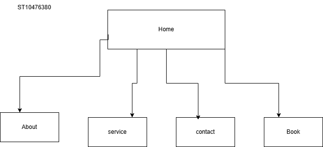

# Project Title
SM Luxury Hair salon

## Student Information
**Student number:** ST10476380  
**Student Name:** Shumani Monyai

## Project Overview

SM Luxury is a small business established to provide a high-end grooming experience for busy professionals   .We aim to develop from traditional pen- and-paper operation which a lot of salons uses to a digital system. SM luxury focuses on solving industrial problems like the “empty chair” problem was “unscheduled gaps lead to loss in revenue “(Thriving Stylist,2025).  
Mission and Vision 
Our mission is to create a Luxury escape for clients no pricing confusions and provide a modern presence  
Target Audience  Busy professionals and parents want a luxury escape without the stress of difficult booking. 
Budget Estimate as per Host Africa(2026)  
	Web Hosting: R99.00 per month  
    Maintenance: R200.00 per month 
	Total Monthly Cost: R299.00 
	Total Annual Cost: R3,588.00 

                                                                                                                                  

## Website Goals and Objectives

Goal
Our goal is to create an online booking system to reduce empty chair problems 
Provide  transparency by displaying all style costs 
Enhance brand by though sites like Facebook,  Instagram, tick tock and  X 

## Timeline and Milestones

Proposal 	Start with the two proposals	Week1 
approval from Lecturer	Due 11/04/2026 
Research & Assets	Sourcing images and writing content Week3 
HTML Development	Create html for each pages Week4 
Submission of part 1	Due 20/04/2026 
	

## Sitemap

   

## References
Afrochic Beauty (n.d.) Passion Twist Hair. Available at: https://afrochicbeauty.com/passion-twist-hair/ (Accessed: 20 April 2026).  
Fashion Style Outfit. (2023) 88 Latest Braids Hairstyle for Ladies 2023: Beautiful Braids to Slay In. Available at: https://www.fashionstyleoutfit.com/88-latest-braids-hairstyle-for-ladies-2023-beautiful-braids-to-slay-in/4/ (Accessed: 20 April 2026).  
Host Africa (2026) Web hosting in South Africa. Available at: https://hostafrica.co.za/web-hosting/ (Accessed: 11 April 2026)  
Thriving Stylist (2025) Unexpected challenges salon owner’s face. Available at: https://thrivingstylist.com/blog/unexpected-challenges-salon-owners-face/ (Accessed: 5 April 2026)      
W3Schools (2026.) HTML Tag. Available at: https://www.w3schools.com/tags/tag_form.asp (Accessed: 20 April 2026).
  
