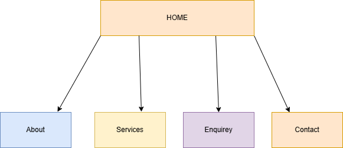

# Project Title
SM Luxury Hair salon

## Student Information
**Student number:** ST10476380  
**Student Name:** Shumani Monyai

## Project Overview

SM Luxury is a small business established to provide a high-end grooming experience for busy professionals. We aim to develop from a traditional pen-and-paper operation that salons use to a digital system. SM luxury focuses on solving industrial problems like the “empty chair” problem was “unscheduled gaps lead to loss in revenue .  

Target Audience  
professionals and parents who want high-quality hair and a luxury escape without the stress of difficult booking. 

Mission and Vision 
Our mission is to create a luxury escape for clients without pricing confusion and to provide a modern presence 
Vision statement 
To be one of the top hair salons known for seamless booking and expert hair services
 
Key features 
Our website will include: 
Home page: the homepage will contain images of a luxury hair design and a button for book now . 
About US: about us page will tell the users more about SM luxury they will get to know the  hairstylists, what to expect and  SM luxury’s  vision and mission 
Service: A gallery of all hairstyles including their prices. 
Enquiry: will contain a Functional form for service inquiries or appointments. 
Contact: were you‘ll find the business contact information. 

                                                                                                                                  

## Website Goals and Objectives

Goal
Our primary goal is to create an online booking system to reduce empty chair problems
objectives
Objective 1 is to reduce empty time slots by at least 20% in the next 3 months
Objective 2 ensure that all the hair styles’ costs are visible ensuring transparency

## Timeline and Milestones
Week 1|Project Proposal| Develop two proposals    
Week 2 (11/04/2027)| Lecture Approval|Get feedback from Lecture  
Week 3|Research & asset |	Source images and write content | view social media platforms  for more ideas  
Week 4|	HTML Development|Putting my plans into action by developing 5 sites using html  
Week 5| (20/04/2026)|Submission of part1 
Week 7|	CCS styling and desktop solution| Adding on to my HTML styling  and organizing my pages 
Week 8|Responsive design| ensure site is responsive and well developed 
Week 9|(29/05/2026)|submission of part2 

## Sitemap

   

## References

Host Africa (2026) Web hosting in South Africa. Available at: https://hostafrica.co.za/web-hosting/ (Accessed: 11 April 2026) 
W3Schools (2026) HTML  Tag. Available at: https://www.w3schools.com/tags/tag_option.asp (Accessed: 20 April 2026). 
Thriving Stylist (2025) Unexpected challenges salon owner’s face. Available at: https://thrivingstylist.com/blog/unexpected-challenges-salon-owners-face/ (Accessed: 5 April 2026)    

  
