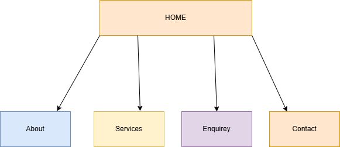

# Project Title
SM Luxury Hair salon

## Student Information
**Student number:** ST10476380  
**Student Name:** Shumani Monyai

## Project Overview

SM Luxury is a small business established to provide a high-end grooming experience for busy professionals. We aim to develop from a traditional pen-and-paper operation that salons use to a digital system. SM luxury focuses on solving industrial problems like the “empty chair” problem was “unscheduled gaps lead to loss in revenue . 

Target Audience  
professionals and parents who want high-quality hair and a luxury escape without the stress of difficult booking. 

Mission and Vision 
Our mission is to create a luxury escape for clients without pricing confusion and to provide a modern presence 
Vision statement 
To be one of the top hair salons known for seamless booking and expert hair services

 
Key features 
Our website will include: 
Home page: the homepage will a slide show imaje of a luxury hair design and a button for book now . 
About US: about us page will tell the users more about SM luxury they will get to know the  hairstylists, what to expect and  SM luxury’s  vision and mission 
Service: A gallery of all hairstyles including their prices. 
Enquiry: will contain a Functional form for service inquiries or appointments. 
Contact: were you‘ll find the business contact information. 

                                                                                                                                  

## Website Goals and Objectives

Goal 
Our primary goal is to create an online booking system to reduce empty chair problems 
objectives 
Objective 1 is to reduce empty time slots by at least 20% in the next 3 months 
Objective 2 ensure that all the hair styles’ costs are visible ensuring transparency

## Timeline and Milestones
| Timeline | Milestone | Key Deliverables & Activities |
| :--- | :--- | :--- |
| **Week 1** | Project Proposal | • Draft and develop two distinct website concepts and layout proposals. |
| **Week 2**  *(11/04/2026)* | Lecture Approval | • Present proposals to the lecturer. • Gather and document feedback for implementation. |
| **Week 3** | Research & Asset Gathering | • Source high-quality images and draft core written content. • Research social media platforms for design ideas and industry trends. |
| **Week 4** | HTML Development | • Translate layouts into structural code. • Build out the core 5 pages using semantic HTML. |
| **Week 5**  *(20/04/2026)* | Milestone Submission | • **Submit Part 1** of the project assignment. |
| **Week 7** | CSS Styling & Desktop Layout | • Implement comprehensive CSS styling. • Organize page layouts and design the desktop viewport solution. |
| **Week 8** | Responsive Design | • Implement media queries. • Optimize fluid layouts to ensure full responsiveness across tablet and mobile displays. |
| **Week 9**  *(29/05/2026)* | Final Submission | • **Submit Part 2** (Final polished web solution). |

## website view
Website on a laptop

Wbsite on a cell phone

## Sitemap

   

## References
CSS Web Design Studio (2026) Fixing horizontal image stretching and mobile columns in CSS flexbox. Available at: https://www.cssdesignstudio.com/flexbox-gallery-fix (Accessed: 28 May 2026).
Host Africa (2026) Web hosting in South Africa. Available at: https://hostafrica.co.za/web-hosting/ (Accessed: 11 April 2026) 
W3Schools (2026) HTML  Tag. Available at: https://www.w3schools.com/tags/tag_option.asp (Accessed: 20 April 2026). 
Thriving Stylist (2025) Unexpected challenges salon owner’s face. Available at: https://thrivingstylist.com/blog/unexpected-challenges-salon-owners-face/ 
(Accessed: 5 April 2026)    

  
